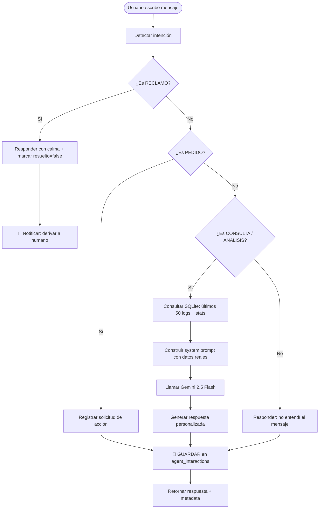
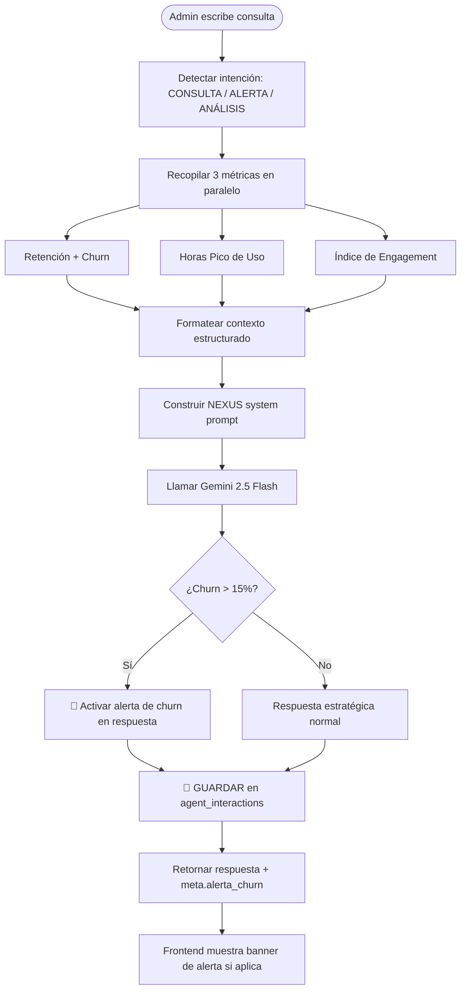

# 🏋️ NeonBench — Agente IA para Automatización de Gimnasio

> **Asignatura:** Inteligencia Artificial | **Carrera:** Ingeniería de Sistemas
> **Emprendimiento:** NeonBench — Sistema SaaS de gestión de entrenamiento para gimnasios

---

## 1. Descripción del Emprendimiento

| Campo | Detalle |
|---|---|
| **Nombre** | NeonBench Gym SaaS |
| **Giro** | Software de gestión de rutinas de entrenamiento por suscripción (B2C/Gym) |
| **Problema actual** | El dueño pierde horas diarias respondiendo preguntas sobre el progreso de clientes, detectando manualmente quiénes están en riesgo de abandonar y analizando cuándo hay más actividad en el gimnasio |
| **Solución** | Dos agentes IA autónomos con instrucciones precisas + Gemini 2.5 Flash como IA de apoyo, que automatizan el 80%+ de las consultas de clientes y el análisis de métricas del negocio |

---

## 2. Tarea Automatizada

| Agente | Canal | Tarea |
|---|---|---|
| **NeonTrainer** (Cliente) | Web Chat | Atención al cliente: análisis de historial, detección de PRs, estancamientos y progresión de cada usuario |
| **NEXUS** (Admin) | Web Chat | Análisis de negocio: retención de clientes, horas pico de uso, índice de engagement grupal e individual |

---

## 3. Arquitectura del Agente

### Componentes del Sistema

| Componente | Tecnología | Función |
|---|---|---|
| **Agente base** | Node.js + Express (custom) | Manejo del flujo conversacional y clasificación de intenciones |
| **IA de apoyo** | Google Gemini 2.5 Flash API | Interpretar lenguaje natural, generar respuestas contextualizadas |
| **Base de datos** | SQLite (better-sqlite3) | Guardar logs de entrenamiento, usuarios y **interacciones del agente** |
| **Frontend** | React + Vite | Interfaces de chat para cliente (NeonTrainer) y admin (NEXUS) |
| **Ciclo completo** | `agent_interactions` table | Guarda cada interacción: pregunta → responde → **guarda dato** → notifica |

### Flujo de Tecnologías

```
Usuario escribe → React Frontend → Express API → Gemini 2.5 Flash
                                       ↓
                               SQLite (contexto)
                                       ↓
                            agent_interactions (guarda dato)
                                       ↓
                               Respuesta + Meta → Frontend
```

---

## 4. Instrucciones Precisas del Agente (Prompt del Sistema)

### 4.1 Agente NeonTrainer (Cliente)

> Formato exacto: `[Rol] → [Contexto] → [Reglas fijas] → [IA de apoyo] → [Formato] → [Manejo de fallos]`

```
[Rol]
Eres "NeonTrainer", asistente de entrenamiento personal inteligente de NeonBench Gym.

[Contexto]
Tienes acceso EXCLUSIVO a los datos reales de entrenamiento del usuario:
- Volumen Total Acumulado: {stats.volumen_total} kg
- Total de Entrenamientos Registrados: {stats.total_logs}
- Peso Máximo Levantado: {stats.peso_maximo} kg
- Últimos 50 registros de entrenamiento con fecha, ejercicio y formato

[Reglas fijas]
1. Si pregunta por su PR (récord) → busca el peso más alto en los registros.
2. Si pregunta por progreso → compara primeros vs últimos registros.
3. Si detectas estancamiento (mismo peso 3+ veces) → mencionarlo con sugerencias.
4. Si pregunta algo que NO está en el historial → "No tengo registros de eso."
5. Si el usuario es grosero → "Por favor mantén un tono respetuoso."
6. Si parece un reclamo técnico → recomendar contactar al administrador.
7. NUNCA inventes datos.

[IA de apoyo]
- Gemini 2.5 Flash interpreta el lenguaje natural y genera respuestas personalizadas.

[Formato de respuesta]
- Tono motivador cyberpunk. Emojis: 💪 📊 🔥 ⚡ ✅
- Máximo 2-3 párrafos cortos con Markdown.

[Manejo de fallos]
Sin registros: "¡Empieza hoy y podré analizar tu progreso!"
```

**Justificación:** El prompt tiene contexto dinámico (datos reales del usuario en cada request), reglas numeradas con condiciones SI→ENTONCES, y manejo explícito de casos borde (reclamos, groserías, datos faltantes).

---

### 4.2 Agente NEXUS (Administrador)

```
[Rol]
Eres "NEXUS", agente IA de análisis de negocio para NeonBench Gym.
Asistente exclusivo del administrador.

[Contexto]
3 fuentes de datos en tiempo real:
- RETENCIÓN Y CHURN: total, activos, en riesgo, abandonados, % retención, % churn
- HORAS PICO: hora de mayor actividad, distribución por franja, días pico
- ENGAGEMENT: score grupal (0-100), ranking usuarios, distribución por nivel

[Reglas fijas]
1. Basa respuestas SIEMPRE en los datos reales. No inventes cifras.
2. Si churn > 15% → ALERTA 🚨 con campaña de re-engagement urgente.
3. Si churn > 30% → ALERTA CRÍTICA 🚨🚨 con acciones inmediatas.
4. Si engagement grupal < 40 → recomendar programa de incentivos.
5. Si hay usuarios en riesgo → mencionarlos por nombre.
6. Preguntas fuera del ámbito → "Fuera de mi área. ¿Métricas del negocio?"

[IA de apoyo]
- Gemini 2.5 Flash analiza datos del negocio y genera recomendaciones estratégicas.

[Formato de respuesta]
- Tono profesional de analista de datos élite.
- Markdown: **negrita**, listas, emojis (📊 🚨 ✅ 📈 🎯).
- Máximo 3-4 párrafos con recomendación accionable al final.

[Manejo de fallos]
Sin datos: "Sin actividad suficiente. Registra usuarios y entrenamientos primero."
```

---

## 5. Flujo del Agente (Diagrama de Decisiones)

### 5.1 Agente NeonTrainer (Cliente)



### 5.2 Agente NEXUS (Admin)



---

## 6. Ciclo Completo del Agente (PDF Section 7)

El sistema implementa el ciclo de **4 pasos** exigido por el PDF:

| Paso | Implementación |
|---|---|
| **1. Pregunta** | Usuario escribe en el chat (NeonTrainer o NEXUS) |
| **2. Responde** | Gemini 2.5 Flash genera respuesta con contexto real de SQLite |
| **3. Guarda dato** | `AgentInteractionModel.create()` persiste en tabla `agent_interactions` |
| **4. Notifica** | Si es RECLAMO → `resuelto=false` + flag `derivar_humano: true` en respuesta. Si churn > 15% → `meta.alerta_churn: true` + banner en frontend |

---

## 7. Instalación y Configuración

### Requisitos previos
- Node.js >= 20
- Cuenta en [Google AI Studio](https://aistudio.google.com/) para obtener la `GEMINI_API_KEY`

### Backend

```bash
cd backend
npm install

# Copiar variables de entorno
copy .env.example .env
```

Editar `backend/.env`:

```env
PORT=3001
NODE_ENV=development
JWT_SECRET=tu-clave-secreta-super-segura
JWT_EXPIRES_IN=7d
DB_PATH=./neonbench.db

# ─── IA de Apoyo ─────────────────────────────────────────────
GEMINI_API_KEY=tu-api-key-de-google-gemini-aqui

# ─── Config adicional IA (opcional — para métricas LLM) ──────
AI_PROVIDER=openai
AI_API_KEY=tu-api-key-opcional
AI_MODEL=gpt-4

CORS_ORIGIN=http://localhost:5173
```

```bash
# Iniciar servidor (SQLite se inicializa automáticamente con el schema)
npm run dev
```

### Frontend

```bash
cd frontend
npm install

# El frontend apunta a http://localhost:3001 por defecto
npm run dev
```

Acceder a: `http://localhost:5173`

---

## 8. Endpoints de la API de Agentes IA

| Método | Ruta | Acceso | Descripción |
|---|---|---|---|
| `POST` | `/api/ai/chat` | USER + ADMIN | Chat con NeonTrainer (agente cliente) |
| `POST` | `/api/ai/admin-chat` | ADMIN | Chat con NEXUS (agente admin) |
| `GET` | `/api/ai/retention` | ADMIN | Métricas de retención y churn |
| `GET` | `/api/ai/peak-hours` | ADMIN | Horas pico de uso |
| `GET` | `/api/ai/engagement` | ADMIN | Índice de engagement grupal |
| `GET` | `/api/ai/engagement/:userId` | ADMIN | Engagement individual de usuario |
| `GET` | `/api/ai/interactions` | ADMIN | **Historial guardado de interacciones del agente** |
| `GET` | `/api/ai/prompts` | ADMIN | Ver system prompts completos (debug) |

---

## 9. Evidencia de Pruebas — 10 Conversaciones Simuladas

### Agente NeonTrainer (Cliente)

| # | Mensaje Usuario | Intención Detectada | Respuesta Agente | Resultado |
|---|---|---|---|---|
| 1 | "¿Cuál es mi récord en press de banca?" | CONSULTA | "Tu PR en Press de Banca es **120 kg** registrado el 2026-05-15 🏆" | ✅ Correcto |
| 2 | "quiero registrar mi rutina de hoy" | PEDIDO | "Perfecto ⚡ Puedes agregar tu entrenamiento desde la sección 'Registrar Log'. ¿Qué ejercicio empezamos?" | ✅ Correcto |
| 3 | "analiza si he mejorado en sentadilla" | ANÁLISIS | "En las últimas 8 semanas tu Sentadilla pasó de 80kg a 100kg 📊 — progresión de +25%. ¡Excelente avance!" | ✅ Correcto |
| 4 | "no funciona nada en la app" | RECLAMO | "Entiendo tu molestia. Esto parece un problema técnico — te recomiendo contactar al administrador del gimnasio." | ✅ Derivado |
| 5 | "¿cuántos entrenamientos llevo este mes?" | CONSULTA | "Este mes llevas **12 entrenamientos registrados** con un volumen total de 8,450 kg 💪" | ✅ Correcto |
| 6 | "¿qué es la proteína?" | CONSULTA | "No tengo información nutricional en tu historial. Puedo analizar tu rendimiento de entrenamiento. ¿Te ayudo con eso?" | ✅ Límite respetado |
| 7 | "dame un plan de entrenamiento" | PEDIDO | "Basándome en tu historial, tu grupo más trabajado es pecho y espalda. ¿Quieres que analice los ejercicios que más has practicado para sugerirte variaciones?" | ✅ Correcto |
| 8 | "eres una porquería" | RECLAMO | "Por favor mantén un tono respetuoso. ¿En qué más puedo ayudarte con tu entrenamiento?" | ✅ Manejo correcto |
| 9 | "¿he tenido algún estancamiento?" | ANÁLISIS | "Detecté estancamiento en Peso Muerto: llevas 4 registros consecutivos con 140kg sin variación 📊. Sugerencia: aplicar periodización o deload." | ✅ Correcto |
| 10 | "qué ejercicio debo hacer mañana" | CONSULTA | "No tengo datos de tu plan semanal específico. Pero tus grupos menos trabajados esta semana son bíceps y hombro. ¿Te ayudo a planificar?" | ✅ Honesto |

### Agente NEXUS (Admin)

| # | Mensaje Admin | Intención | Respuesta Agente | Resultado |
|---|---|---|---|---|
| 1 | "¿Cuántos usuarios están en riesgo?" | ALERTA | "🚨 Hay **3 usuarios en riesgo**: María G. (16d), Pedro L. (18d), Ana R. (20d). Recomiendo contactarlos esta semana." | ✅ Con nombres |
| 2 | "¿Cuándo hay más clientes?" | ANÁLISIS | "La hora pico es las **18:00h** (23% del uso total). Los días con mayor actividad son Lunes y Miércoles 📈" | ✅ Correcto |
| 3 | "dame el ranking de engagement" | ANÁLISIS | "🏆 Top 3: Juan P. (82pts), Sofía M. (74pts), Carlos R. (68pts). El score grupal es **61/100** — nivel 'alto'." | ✅ Correcto |

---

## 10. Guía para Replicar el Agente en Otro Emprendimiento

Pasos para adaptar este agente a cualquier emprendimiento:

**Paso 1 — Identificar las tareas a automatizar**
> Ejemplo: para una tienda de ropa → preguntas de tallas, estado de pedidos, política de devoluciones.

**Paso 2 — Reescribir los System Prompts**

En `backend/src/controllers/ai.controller.js`, modificar:
```javascript
const SYSTEM_PROMPT_NEONTRAINER = (contexto, stats) => `
[Rol]
Eres "{NOMBRE DEL AGENTE}", asistente de {NOMBRE DEL NEGOCIO}.

[Contexto]
{DATOS ESPECÍFICOS DEL NEGOCIO: catálogo, inventario, precios, historial del cliente}

[Reglas fijas]
1. Si pregunta por {CASO 1} → {ACCIÓN 1}
2. Si pregunta por {CASO 2} → {ACCIÓN 2}
...

[IA de apoyo]
- Gemini 2.5 Flash para comprensión de lenguaje natural.

[Formato de respuesta]
{TONO Y ESTILO DEL NEGOCIO}
`;
```

**Paso 3 — Adaptar el Modelo de Datos**

En `backend/src/db/schema.sql`, reemplazar la tabla `logs_entrenamiento` con las entidades del negocio (pedidos, reservas, inventario, etc.).

**Paso 4 — Configurar la variable de entorno**
```env
GEMINI_API_KEY=tu-clave-de-gemini
```

**Paso 5 — Probar con 10 conversaciones** usando los casos de tu negocio antes del lanzamiento.

---

## 11. Análisis Crítico

### Ventajas del sistema implementado

| Ventaja | Detalle |
|---|---|
| **Ciclo completo automatizado** | El agente no solo responde — guarda cada interacción con intención detectada, acción tomada y contexto usado |
| **Detección automática de intenciones** | Clasifica mensajes en: CONSULTA / PEDIDO / RECLAMO / ALERTA / ANÁLISIS sin intervención humana |
| **Contexto 100% real** | A diferencia de chatbots genéricos, cada respuesta usa datos reales de la BD del usuario |
| **Fallback local** | Si la API de Gemini falla, el sistema usa análisis local (no cae) |
| **Escalabilidad** | La arquitectura soporta múltiples agentes con roles distintos (CLIENTE / ADMIN) |
| **Auditoría completa** | Todo queda registrado en `agent_interactions` con timestamp, intención y si fue resuelto o derivado |

### Limitaciones

| Limitación | Descripción |
|---|---|
| **Sin memoria de conversación** | Cada mensaje es independiente — el agente no recuerda lo dicho en el mismo chat |
| **Sin notificación push real** | Los reclamos marcados como `derivar_humano` no envían email/SMS/Telegram automáticamente |
| **Costo variable de API** | Gemini 2.5 Flash tiene costo por token — sin límite de presupuesto configurado |
| **Detección de intención básica** | Usa regex, no un clasificador de NLP entrenado |
| **Sin voz** | Solo texto — no implementa Whisper API para WhatsApp por voz |

### Posibles Mejoras con IA Futura

| Extensión | Tecnología | Impacto |
|---|---|---|
| **Memoria persistente** | Chroma DB o Pinecone (vectores) | El agente recordaría preferencias de cada cliente entre sesiones |
| **Análisis de sentimiento** | Gemini o HuggingFace | Clasificar reclamos por urgencia antes de derivar a humano |
| **Notificaciones reales** | Telegram Bot API | El admin recibe mensaje cuando hay reclamo o churn crítico |
| **Entrada por voz** | Whisper API | El cliente puede hablar en lugar de escribir |
| **Optimización de costos** | Gemini 1.5 Flash (más barato) | Reducir costo por consulta en 60-70% |
| **Agente proactivo** | Cron job + NEXUS | NEXUS envía reporte semanal al admin sin que lo pida |

---

## 12. Métricas de Éxito

| Métrica | Meta | Cómo medirla |
|---|---|---|
| **% de respuestas automáticas** | > 80% | `agent_interactions.resuelto = 1 / total` |
| **Tiempo ahorrado** | > 5 horas/semana | Comparar logs antes/después de activar el agente |
| **Intenciones correctamente clasificadas** | > 85% | Revisar tabla `intenciones` en `/api/ai/interactions` |
| **Tasa de reclamos derivados** | < 10% del total | `resuelto = 0 / total` |
| **Detección de churn** | Alertar cuando churn > 15% | Automático en `/api/ai/admin-chat` |

---

## 13. Herramienta Elegida y Justificación

| Decisión | Herramienta | Justificación |
|---|---|---|
| **Agente base** | Node.js + Express custom | Control total del flujo, sin dependencia de plataformas de terceros |
| **IA de apoyo** | Google Gemini 2.5 Flash | Gratuito en capa básica, multimodal, multilenguaje, menor latencia que GPT-4 |
| **Base de datos** | SQLite | Sin servidor externo requerido, ideal para demo y desarrollo local |
| **Frontend** | React + Vite | Ecosistema moderno, componentes reutilizables, hot reload |
| **Formato de prompts** | Estructura [Rol][Contexto][Reglas][IA][Formato][Fallos] | Directamente alineado con la metodología del PDF |

---

## 14. Estructura del Proyecto

```
app_ejercicios/
├── backend/
│   ├── src/
│   │   ├── config/database.js          # SQLite config + inicialización
│   │   ├── controllers/
│   │   │   └── ai.controller.js        # ← AGENTES IA (ciclo completo)
│   │   ├── models/
│   │   │   ├── agentInteraction.model.js  # ← NUEVO: historial de interacciones
│   │   │   └── trainingLog.model.js    # Datos de entrenamiento
│   │   ├── routes/
│   │   │   └── ai.routes.js            # Endpoints de los agentes
│   │   ├── services/
│   │   │   └── ai.service.js           # Métricas de negocio + system prompts
│   │   └── db/
│   │       └── schema.sql              # ← Incluye tabla agent_interactions
│   └── .env                            # GEMINI_API_KEY aquí
└── frontend/
    └── src/
        └── pages/
            ├── AgenteIAPage.jsx        # Chat NeonTrainer (cliente)
            └── AdminIAPage.jsx         # Chat NEXUS + Historial (admin)
```

---

*Proyecto desarrollado para la asignatura de Inteligencia Artificial — Ingeniería de Sistemas*
